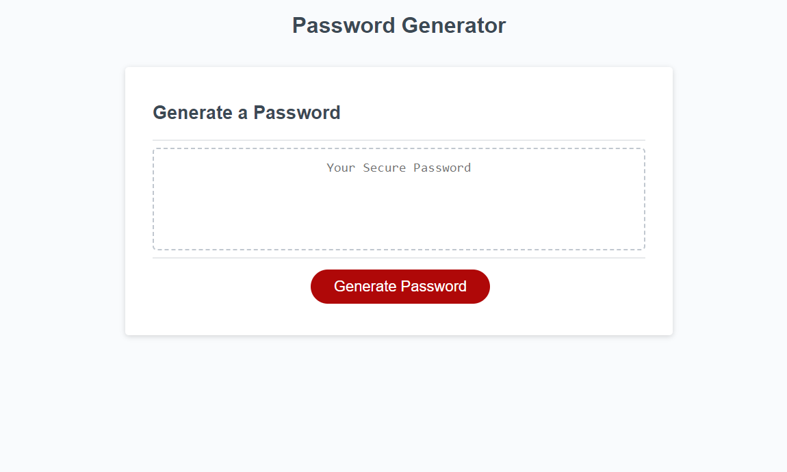

# PassGenJS

## Description

This repository hosts a random password generator program. When accessing this web page you will start a list of prompts by hitting the generate button. You will be prompted to select a password length between 8 and 128 characters. Upon selecting how long you want your random password to be you will be prompted with character types (uppercase, lowercase, numbers, and symbols) for your personal choosing for generating a password just for you. 

## Goal

The goal of this project was to learn how to tie in all three languages effectively and showcase my ability in making a static website truly interactive. 

## Purpose

The purpose of this program is to generate a secure password. It does this by randomly selecting components of possible password criteria for you expelling personal characteristics that a user might add (which is assumable). Using the password generator will also assist in securing each account individually. If one of your accounts hosting a personal password is compromised this could leak into your other accounts should you reuse that password too many times. Make your password unique for each account and completely seperate from a mind generated password to maximize security.

## Technologies

-HTML
-CSS
-JavaScript

## Screenshots (Deployable Page Link)

## License

MIT License

Copyright (c) 2022 fabien1313

Permission is hereby granted, free of charge, to any person obtaining a copy
of this software and associated documentation files (the "Software"), to deal
in the Software without restriction, including without limitation the rights
to use, copy, modify, merge, publish, distribute, sublicense, and/or sell
copies of the Software, and to permit persons to whom the Software is
furnished to do so, subject to the following conditions:

The above copyright notice and this permission notice shall be included in all
copies or substantial portions of the Software.

THE SOFTWARE IS PROVIDED "AS IS", WITHOUT WARRANTY OF ANY KIND, EXPRESS OR
IMPLIED, INCLUDING BUT NOT LIMITED TO THE WARRANTIES OF MERCHANTABILITY,
FITNESS FOR A PARTICULAR PURPOSE AND NONINFRINGEMENT. IN NO EVENT SHALL THE
AUTHORS OR COPYRIGHT HOLDERS BE LIABLE FOR ANY CLAIM, DAMAGES OR OTHER
LIABILITY, WHETHER IN AN ACTION OF CONTRACT, TORT OR OTHERWISE, ARISING FROM,
OUT OF OR IN CONNECTION WITH THE SOFTWARE OR THE USE OR OTHER DEALINGS IN THE
SOFTWARE.